<h2 align="center">👋 Hello!</h2>

  <a href="https://www.arcanexus.com">Blog</a> •
  <a href="https://bsky.app/profile/arcanexus.com">BlueSky</a>

<!--
FORKED FROM https://github.com/qjoly/QJoly/blob/main/README.md

Here are some ideas to get you started:

- 🔭 I’m currently working on ...
- 🌱 I’m currently learning ...
- 👯 I’m looking to collaborate on ...
- 🤔 I’m looking for help with ...
- 💬 Ask me about ...
- 📫 How to reach me: ...
- 😄 Pronouns: ...
- ⚡ Fun fact: ...
-->
- 🔭 I’m currently working at [Finaxys](https://www.finaxys.com/).
- 🌱 I’m currently learning more on IT architecture and better [X-as-code](https://quadralogics.com/research/XAsCode.html) practices.
- 💬 Ask me about **Cloud, Kubernetes and Python**
- 📫 How to reach me: [@arcanexus.com](https://bsky.app/profile/arcanexus.com) on BlueSky.

 -------

### Stats

 

  

 

  

